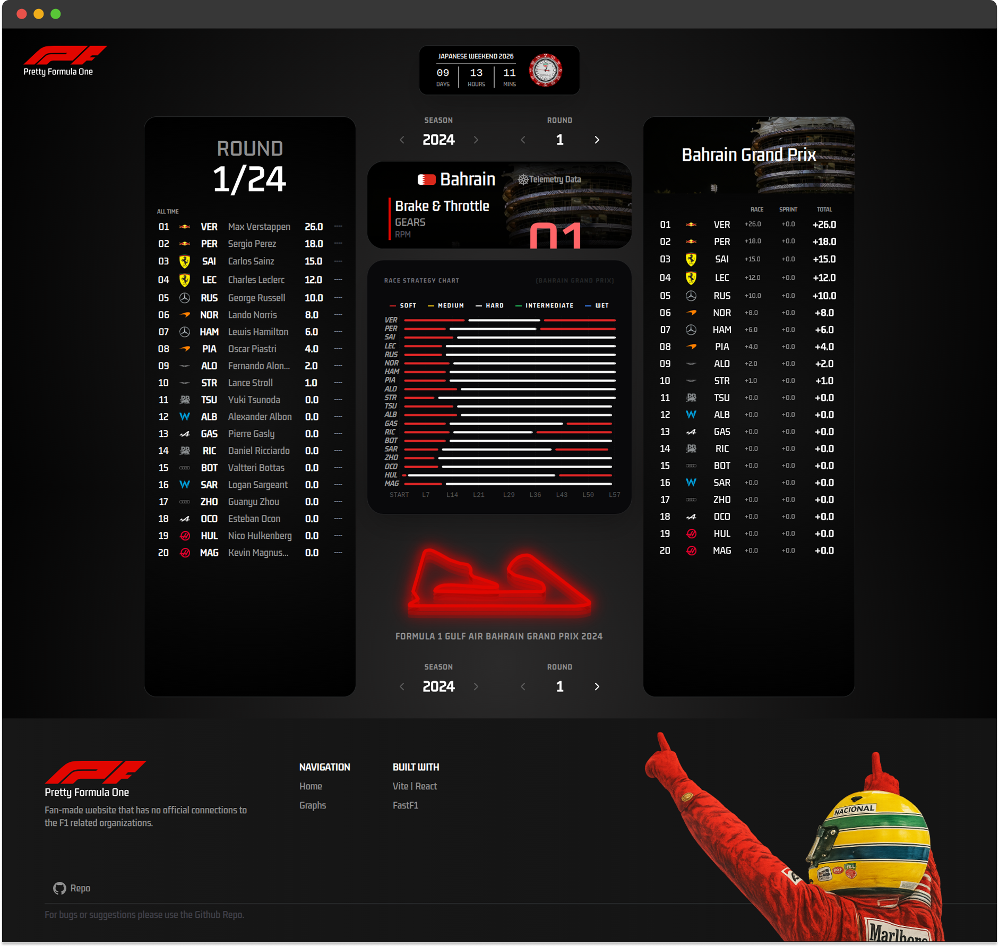
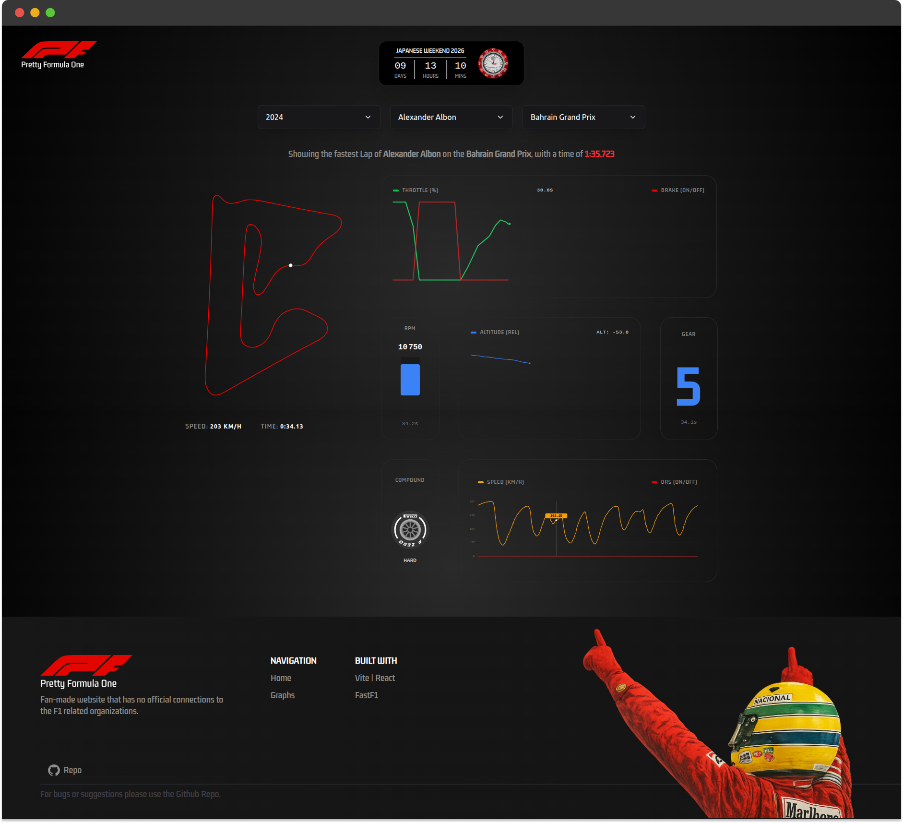

# Pretty Formula One

A fan-made website to see telemtry in a easy manner. Telemetry is seen in a graphical way and with near-zero delay or loading screens.

## Screenshots

## Technical details

The project is rather simple, it needs a frontend and a source of data to serve the `.json` and `.csv` files. The main problem here is the approach selected to display these values.

The priority here is the low cost and low maintenance, so in order to do that I had some different attempts.

### Architectural Evolution

1. Local Files (The "Bare Metal" Approach)

To reach low response times and low maintenance cost, the first solution is to do all locally. Initially, telemetry data was stored as static JSON/CSV files within the repository.

- Pros: Zero latency for data retrieval; no external dependencies; $0 cost.

- Cons: High Space Consumption. Git repositories bloat quickly with large text data, making the project difficult to manage/clone and deploy on free-tier platforms.

2. Serverless Functions (The Vercel API Approach)

I attempted to process and serve data through Vercel's serverless functions on demand. And a side free database service as MongoDB Atlas. This was possible because at the momento the amount of data to be stored is not that big (less than 1GB). 

Pros: Dynamic data handling; keeps the repository "thin."

Cons: Processing large telemetry packets often takes 5-10s which is contradictory to the project idea; Number of access in order to keep the connection "warm" was an overhead and would quickly reach the MongoDB atlas limit of requests per day.

3. External API with Paywall (The Scaling Approach)

I considered as a final alternative a robust backend with Django or NestJS to actively communicate with a dedicated database server. However that would cost me a certain price and consequently I would need to charge users of the website to pay the bills. The initial idea was to keep the telemetry of some famous drivers like Max Verstappen behind a paywall.

Pros: Professional-grade reliability; handles massive datasets; monetization ready.

Cons: High Infrastructure Complexity. Moving away from the "low maintenance" goal. Managing a dedicated database, authentication, and a paywall requires significant time investment.

4. Vercel Blob (The Final Solution)

The current architecture leverages Vercel Blob for specialized object storage. Basically, Vercel offers a Storage service up to 1GB on free tiers which is currently enough for the size of the project. Each season of telemetry data weights approximately ~50MB.

Pros: Extremely Fast. High-speed edge delivery ensures the track map and telemetry graphs feel responsive. It bridges the gap between static files and a full database.

Cons: Storage Ceiling. Limit on the number of operations (upload/deletion/etc).

### Conclusion

As of right now, the temporary solution is the Vercel Blobs, but as data can increase in the future, new approaches might take place.
